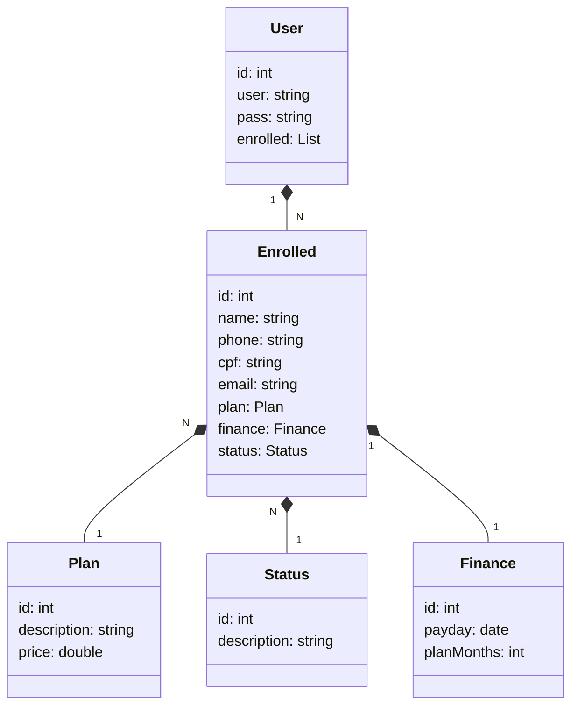

```mermaid

classDiagram
  class User {
    id: int
    user: string
    pass: string
    enrolled: List<Enrolled>
  }

  class Enrolled {
    id: int
    name: string
    phone: string
    cpf: string
    email: string
    plan: Plan
    finance: Finance
    status: Status
  }

  class Plan {
    id: int
    description: string
    price: double
  }

  class Status {
    id: int
    description: string
  }

  class Finance {
    id: int
    payday: date
    planMonths: int
  }

  User "1" *-- "N" Enrolled
  Enrolled "N" *-- "1" Plan
  Enrolled "N" *-- "1" Status
  Enrolled "1" *-- "1" Finance

```